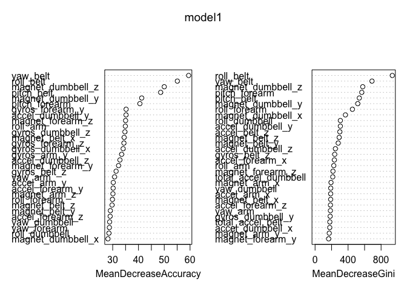

## Activity Predition

### Data Summary
Using devices such as Jawbone Up, Nike FuelBand, and Fitbit it is now possible to collect a large amount of data about personal activity relatively inexpensively. These type of devices are part of the quantified self movement – a group of enthusiasts who take measurements about themselves regularly to improve their health, to find patterns in their behavior, or because they are tech geeks. One thing that people regularly do is quantify how much of a particular activity they do, but they rarely quantify how well they do it. In this project, your goal will be to use data from accelerometers on the belt, forearm, arm, and dumbell of 6 participants. They were asked to perform barbell lifts correctly and incorrectly in 5 different ways. More information is available from the website here: http://groupware.les.inf.puc-rio.br/har (see the section on the Weight Lifting Exercise Dataset).

### Data Source

[Training Data] https://d396qusza40orc.cloudfront.net/predmachlearn/pml-training.csv
[Testing Data] https://d396qusza40orc.cloudfront.net/predmachlearn/pml-testing.csv

The data for this project come from this source: http://groupware.les.inf.puc-rio.br/har.

### Analysis Goal
Design a model using Training data and use that model to predict activity of Testing data

### Breifing of the code

Load useful libraries

```r
library(e1071)
```

```
## Warning: package 'e1071' was built under R version 3.4.4
```

```r
library(caret)
```

```
## Warning: package 'caret' was built under R version 3.4.4
```

```
## Loading required package: lattice
```

```
## Loading required package: ggplot2
```

```r
library(dplyr)
```

```
## 
## Attaching package: 'dplyr'
```

```
## The following objects are masked from 'package:stats':
## 
##     filter, lag
```

```
## The following objects are masked from 'package:base':
## 
##     intersect, setdiff, setequal, union
```

```r
library(randomForest)
```

```
## Warning: package 'randomForest' was built under R version 3.4.4
```

```
## randomForest 4.6-14
```

```
## Type rfNews() to see new features/changes/bug fixes.
```

```
## 
## Attaching package: 'randomForest'
```

```
## The following object is masked from 'package:dplyr':
## 
##     combine
```

```
## The following object is masked from 'package:ggplot2':
## 
##     margin
```

Download & read source data csv

```r
# Set Main directory path
maindir <- "/Users/mycomputer/Documents/RProgramming"
# Set Working directory path
path <- paste(maindir, "/Course8Assignment", sep = "")

# Check if desired working directory path exist or not
# if exist then set working directory else create directory and set it accordingly
if (dir.exists(file.path(path))){
        setwd(file.path(path))
}else {
        dir.create(file.path(maindir, "Course8Assignment"))
        setwd(file.path(path))
}

# Download the dataset to work on
training.fileurl <- "https://d396qusza40orc.cloudfront.net/predmachlearn/pml-training.csv"
download.file(training.fileurl, destfile = "pml-training.csv")

testing.fileurl <- "https://d396qusza40orc.cloudfront.net/predmachlearn/pml-testing.csv"
download.file(testing.fileurl, destfile = "pml-testing.csv")

setwd(file.path(path))

training.data <- read.csv("pml-training.csv",na.strings=c("NA","#DIV/0!",""))
testing.data <- read.csv("pml-testing.csv",na.strings=c("NA","#DIV/0!",""))
```

Sumaarizing Training & Test data (I have commented call to "str" function, because the output is quite large to display)

```r
dim(training.data)
```

```
## [1] 19622   160
```

```r
dim(testing.data)
```

```
## [1]  20 160
```

```r
# str(training.data)

# str(testing.data)
```

There are many columns which have NA values through out, hence removing those from Training dataset

```r
colswithallmiss <- sapply(training.data, function(x)all(any(is.na(x))))

clean.training.data <- training.data[,!colswithallmiss]

# Apart from removing columns with all NA values, we have a choice to remove non relevant predictors as well. nearZeroVar function helps to make that decision, however seeing it's result we cannot confirm if the columns we throw out are really not a predictor. Hence I choose to keep all of the columns accept X & user_name. X because it contains just row number value and user_name wont help much in predicting the outcome
nzv.training.data <- nearZeroVar(clean.training.data, saveMetrics = TRUE)

clean.training.data <- clean.training.data %>% select(-X, -user_name)
```

I am going to use randomForest algorithm to build the model. For purpose of cross validating the model I will partition the Training dataset in 75:25 ratio

```r
isTrainData <- createDataPartition(clean.training.data$classe, p = 0.75, list = FALSE)
cv.Train.Data <- clean.training.data[isTrainData, ]
cv.Test.Data <- clean.training.data[-isTrainData, ]
```

While running the test on my machine, randomForest function & train function was running very slow on the cv.Train.Data. I also got an error stating that maximum 53 variables can only used to build a model. Hence I have excluded few more columns from dataset.

```r
cv.Train.Data <- cv.Train.Data %>% select(-raw_timestamp_part_1, -raw_timestamp_part_2, -cvtd_timestamp, -new_window, -num_window)
cv.Test.Data <- cv.Test.Data %>% select(-raw_timestamp_part_1, -raw_timestamp_part_2, -cvtd_timestamp, -new_window, -num_window)
```

Building model. I tried running randomForest function using default parameter settings. I then tried to fine tune the model by setting number of trees "ntree" = 500 (which is also default) and number of variables randomly sampled at each stage "mtry" = 15.

```r
set.seed(233)

model1 <- randomForest(classe ~ ., data = cv.Train.Data, importance = TRUE)
print(model1)
```

```
## 
## Call:
##  randomForest(formula = classe ~ ., data = cv.Train.Data, importance = TRUE) 
##                Type of random forest: classification
##                      Number of trees: 500
## No. of variables tried at each split: 7
## 
##         OOB estimate of  error rate: 0.46%
## Confusion matrix:
##      A    B    C    D    E  class.error
## A 4183    1    0    0    1 0.0004778973
## B   14 2831    3    0    0 0.0059691011
## C    0   15 2550    2    0 0.0066225166
## D    0    0   23 2387    2 0.0103648425
## E    0    0    1    5 2700 0.0022172949
```

```r
model2 <- randomForest(classe ~ ., data = cv.Train.Data, importance = TRUE, ntree = 500, mtry = 15)
print(model2)
```

```
## 
## Call:
##  randomForest(formula = classe ~ ., data = cv.Train.Data, importance = TRUE,      ntree = 500, mtry = 15) 
##                Type of random forest: classification
##                      Number of trees: 500
## No. of variables tried at each split: 15
## 
##         OOB estimate of  error rate: 0.46%
## Confusion matrix:
##      A    B    C    D    E  class.error
## A 4184    1    0    0    0 0.0002389486
## B   16 2828    4    0    0 0.0070224719
## C    0   11 2549    7    0 0.0070120764
## D    0    0   22 2389    1 0.0095356551
## E    0    0    2    4 2700 0.0022172949
```

Error rate have increased to 0.46% for mtry = 15 from 0.43% for mtry = 7. We can check the change in error rate by further increasing the No. of variables tried at each split. But for now I will use model1 which have seemed to performed better

Now, let's run prediciton on our cv.Test.Data & cv.Train.Data. These will give us the accurancy rate of our model


```r
predictTrain <- predict(model1, cv.Train.Data, type = "class")
print(table(predictTrain, cv.Train.Data$classe))
```

```
##             
## predictTrain    A    B    C    D    E
##            A 4185    0    0    0    0
##            B    0 2848    0    0    0
##            C    0    0 2567    0    0
##            D    0    0    0 2412    0
##            E    0    0    0    0 2706
```

```r
predictTest <- predict(model1, cv.Test.Data, type = "class")
print(table(predictTest, cv.Test.Data$classe))
```

```
##            
## predictTest    A    B    C    D    E
##           A 1395    4    0    0    0
##           B    0  941    9    0    0
##           C    0    4  844    6    0
##           D    0    0    2  797    0
##           E    0    0    0    1  901
```

```r
print(mean(predictTest == cv.Test.Data$classe))
```

```
## [1] 0.9946982
```

So for Train data accuracy rate looks 100% and for Test Data it is 99%.This is really good percentage.
Let's draw a plot to see which are the important predictors used by the model.

```r
varImpPlot(model1)
```

<!-- -->

Now that we have seen randomForest algorithm, let's compare the model with another one. I am using rpart model here

```r
model_rpart <- train(classe ~ ., data = cv.Train.Data, method = "rpart")
pred_rpart <- predict(model_rpart, cv.Train.Data)
print(table(pred_rpart, cv.Train.Data$classe))
```

```
##           
## pred_rpart    A    B    C    D    E
##          A 3813 1200 1192 1088  395
##          B   60  957   78  416  363
##          C  302  691 1297  908  722
##          D    0    0    0    0    0
##          E   10    0    0    0 1226
```

```r
print(mean(pred_rpart == cv.Train.Data$classe))
```

```
## [1] 0.4955157
```

```r
pred_rpart_Test <- predict(model_rpart, cv.Test.Data)
print(table(pred_rpart_Test, cv.Test.Data$classe))
```

```
##                
## pred_rpart_Test    A    B    C    D    E
##               A 1267  381  395  361  129
##               B   21  329   30  152  123
##               C  103  239  430  291  244
##               D    0    0    0    0    0
##               E    4    0    0    0  405
```

```r
print(mean(pred_rpart_Test == cv.Test.Data$classe))
```

```
## [1] 0.4957178
```
The accuracy with this model have gone down to 49%. Hence we can now rely on model built using randomForest method.

Finally, let's run the model on our Test data to predict the activity

```r
pred_rf_test <- predict(model1, testing.data)
print(pred_rf_test)
```

```
##  1  2  3  4  5  6  7  8  9 10 11 12 13 14 15 16 17 18 19 20 
##  B  A  B  A  A  E  D  B  A  A  B  C  B  A  E  E  A  B  B  B 
## Levels: A B C D E
```

## Conclusion
I used random forest algorithm to build a model which can efficiently predict the activities of test data. Having run other algorithm on the training data, but the accuracy percent was quite less.


